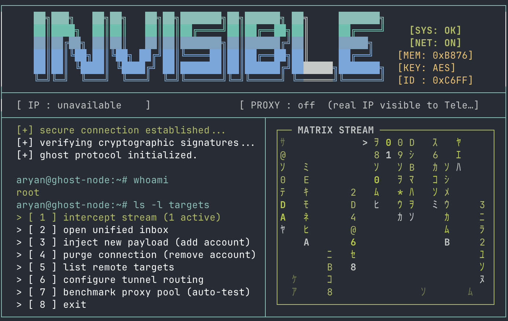
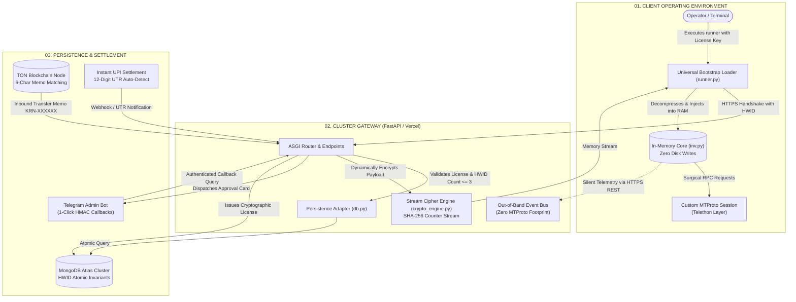

<div align="center">

# INVKRONOS

### Zero-Presence MTProto Telegram Power-Client, In-Memory RAM Execution Engine &amp; Cryptographic Licensing Gateway

[](https://python.org)
[](https://fastapi.tiangolo.com)
[](https://github.com/LonamiWebs/Telethon)
[](https://ton.org)
[](https://mongodb.com)
[](https://vercel.com)
[](LICENSE)
[-0A0A0A?style=flat-square&logo=github&logoColor=white)](https://github.com/thatonearyan-sh)

<table width="100%" border="0" style="border: none; background: transparent; border-collapse: collapse;">
  <tr style="border: none; background: transparent;">
    <td width="48%" valign="middle" align="left" style="border: none; background: transparent; padding-right: 20px;">
      <p align="left" style="margin-bottom: 8px;">
        <b style="color: #00E5FF; font-size: 15px;">Ghost Node Operations Engine</b>
      </p>
      
      <br /><br />
      <p align="left" style="font-size: 13.5px; line-height: 1.6; color: #CBD5E1;">
        Institutional privacy engineering framework featuring zero-disk RAM payload execution, MTProto presence API stripping, automated view-once media interception, and serverless cryptographic licensing.
      </p>
    </td>
    <td width="52%" valign="middle" align="center" style="border: none; background: transparent;">
      
    </td>
  </tr>
</table>

<br />

[System Architecture](#-system-architecture) &bull;
[Technical Philosophy](#-technical-philosophy--presence-stripping) &bull;
[The Full Arsenal (38 Tools)](#-the-full-arsenal-38-stealth-tools) &bull;
[Cryptographic Licensing Core](#-cryptographic-licensing--ram-engine) &bull;
[Payment Rails (UPI &amp; TON)](#-payment-rails-upi--ton-blockchain) &bull;
[Deployment Guide](#-deployment-guide) &bull;
[Developer API](#-developer-api-examples)

---

</div>

## <svg width="20" height="20" viewBox="0 0 24 24" fill="none" stroke="#00E5FF" stroke-width="2" stroke-linecap="round" stroke-linejoin="round" style="vertical-align: -3px; margin-right: 8px;"><path d="M4 17l6-6-6-6M12 19h8"/></svg> Ghost Node Interface

INVKRONOS features an asynchronous, 24-bit ANSI terminal console featuring real-time Katana Matrix streams at 22 FPS, active cryptographic signature verification, live memory telemetry (`SYS`, `NET`, `MEM`, `KEY`, `ID`), and tunnel routing benchmarks.

---

## <svg width="20" height="20" viewBox="0 0 24 24" fill="none" stroke="#00E5FF" stroke-width="2" stroke-linecap="round" stroke-linejoin="round" style="vertical-align: -3px; margin-right: 8px;"><rect x="3" y="3" width="18" height="18" rx="2"/><path d="M3 9h18"/><path d="M9 21V9"/></svg> System Architecture

INVKRONOS decouples client execution, memory protection, transaction settlement, and out-of-band audit logging across an isolated 3-tier matrix:



---

## <svg width="20" height="20" viewBox="0 0 24 24" fill="none" stroke="#00E5FF" stroke-width="2" stroke-linecap="round" stroke-linejoin="round" style="vertical-align: -3px; margin-right: 8px;"><polygon points="13 2 3 14 12 14 11 22 21 10 12 10 13 2"/></svg> Technical Philosophy &amp; Presence Stripping

Standard Telegram applications broadcast granular client states across the MTProto protocol whenever a user interacts with a conversation. INVKRONOS eliminates these telemetry vectors entirely:

### 1. Bypassing the Presence API
- **Read Receipts**: The official client automatically sends `ReadHistoryRequest` when a dialog is opened. INVKRONOS bypasses this completely, fetching raw message bytes directly from server cache without updating read pointers.
- **Typing Indicators**: Suppresses all `UpdateUserTyping` packets.
- **Media Upload Flags**: Drops `SendMessageUploadDocumentAction` and `SendMessageRecordAudioAction`.
- **Scheduled Drop Routing**: Leverages the Telegram API `schedule_date` parameter to push payloads into the server-side queue, delivering messages instantly to recipients without ever broadcasting an active, typing user status.

### 2. Ephemeral Media Interception &amp; Decryption
- **View-Once Photos &amp; Videos**: Telegram prevents screenshots and deletes ephemeral media post-viewing. INVKRONOS intercepts the raw encrypted media packets directly from the event loop and saves them permanently into `.media_vault/`.
- **Voice Note Transcriber**: Converts incoming `.ogg` / `.oga` voice messages via `pydub` and `ffmpeg` into 16kHz WAV streams, transcribing them silently via Google Speech or Whisper. The sender receives zero listening indications.

### 3. Multi-Account String Session Architecture
Instead of SQLite `.session` files prone to multi-process write locks, INVKRONOS serializes authenticated credentials into Base64 String Sessions stored in `accounts.json`:
- **Instant Hot-Swapping**: Cycle identities on the fly without closing active connections.
- **Server Portability**: Move instances across servers, Docker containers, or Termux environments without SQLite corruption.
- **Proxy Binding**: Assign dedicated SOCKS5/HTTP proxies per account to isolate IP footprints.

---

## <svg width="20" height="20" viewBox="0 0 24 24" fill="none" stroke="#00E5FF" stroke-width="2" stroke-linecap="round" stroke-linejoin="round" style="vertical-align: -3px; margin-right: 8px;"><path d="M14.7 6.3a1 1 0 0 0 0 1.4l1.6 1.6a1 1 0 0 0 1.4 0l3.77-3.77a6 6 0 0 1-7.94 7.94l-6.91 6.91a2.12 2.12 0 0 1-3-3l6.91-6.91a6 6 0 0 1 7.94-7.94l-3.76 3.76z"/></svg> The Full Arsenal (38 Stealth Tools)

| Tool # | Feature Name | Core Functionality &amp; Network Behavior | Stealth Level |
| :---: | :--- | :--- | :---: |
| **01** | **List All Chats** | Passive dialog extraction without updating presence or read pointers. | `Passive` |
| **02** | **Read Messages** | Raw stream ingestion without triggering `ReadHistoryRequest` (zero double ticks). | `Ghost` |
| **03** | **Search Within Chat** | Targeted keyword recon extracting timestamps, sender IDs, and context. | `Passive` |
| **04** | **Global Search** | Cross-dialogue search queries across Telegram server-side indices. | `Passive` |
| **05** | **Search Date Range** | Scrapes dialog history inside isolated temporal windows. | `Passive` |
| **06** | **Search Media Type** | Filters massive chats by payload types (photos, videos, documents, audio). | `Passive` |
| **07** | **Pinned Messages** | Direct extraction of pinned data without loading channel interfaces. | `Passive` |
| **08** | **Chat / Group Info** | Deep metadata inspection via `GetFullUserRequest` &amp; `GetFullChannelRequest`. | `Passive` |
| **09** | **Mutual Groups** | Cross-references target accounts against user dialogs to map social graphs. | `Passive` |
| **10** | **Send Message** | Direct payload transmission via `schedule_date` queue (bypasses typing status). | `Ghost` |
| **11** | **Reply to Message** | Links `reply_to` message ID into scheduled payloads without activity flags. | `Ghost` |
| **12** | **Universal Scheduler** | Batch folder extraction, 10-media album bypass, and strict `HH:MM` timing loops. | `Stealth` |
| **13** | **Delete Message** | Executes global `DeleteMessagesRequest` across both sender and target devices. | `Destructive` |
| **14** | **Forward Message** | Routes messages without opening origin chats or leaving read markers. | `Ghost` |
| **15** | **Ghost Forwarder** | Bypasses forward-restricted chats via download-reupload pivot. | `Ghost` |
| **16** | **Export Chat** | Rips complete conversations into formatted TXT or machine-readable JSON arrays. | `Archival` |
| **17** | **Download Media** | Direct full-resolution media extraction bypassing UI compression. | `Archival` |
| **18** | **Bulk Download** | Systematically dumps all photos, videos, audio, and documents in a chat. | `Archival` |
| **19** | **Profile Stalker** | Rips highest-resolution avatar, bio history, and account flags for offline review. | `Intel` |
| **20** | **Online Watcher** | Real-time presence polling logging exact online/offline transition timestamps. | `Intel` |
| **21** | **Find User** | Resolves raw integer user IDs into complete profiles and usernames. | `Intel` |
| **22** | **Auto-Reply Bot** | Automated keyword-triggered responder utilizing scheduled delivery. | `Automation` |
| **23** | **Bulk Send** | Mass-dispatch engine sequentially delivering payloads to target lists. | `Broadcast` |
| **24** | **Block / Unblock** | Direct `BlockRequest` manipulation from the command line interface. | `Admin` |
| **25** | **Online Pattern Analyzer** | Automated 10-second polling interval generating active vs idle ratio reports. | `Deep Intel` |
| **26** | **Keyword Alert Stream** | Real-time update stream listener intercepting trigger phrases across dialogs. | `Deep Intel` |
| **27** | **Nuclear Delete** | Scans and permanently purges every message sent by the user across a conversation. | `Destructive` |
| **28** | **Group Member Scraper** | Dumps member names, usernames, and raw integer IDs to formatted CSV files. | `Deep Intel` |
| **29** | **Chat Deep Stats** | Computes statistical frequency distributions, peak active hours, and media ratios. | `Analytics` |
| **30** | **Schedule Queue Manager**| Audits, verifies, or cancels payloads sitting in server-side schedule queues. | `Management` |
| **31** | **Self-Destruct Message** | Enforces cryptographic Time-To-Live (TTL) deletion in secret chats. | `Ephemeral` |
| **32** | **Live Monitor Mode** | Streams raw MTProto API update packets directly to terminal stdout. | `Protocol` |
| **33** | **Active Devices Manager** | Inspects authenticated sessions, IP addresses, and executes remote revocation. | `Security` |
| **34** | **Edit Profile** | Updates user name, bio, and username metadata via command line. | `Identity` |
| **35** | **Switch Account** | Hot-swaps authenticated string sessions without terminating connections. | `Session` |
| **36** | **Exit Cleanly** | Closes asynchronous event loops, flushes memory, and severs sockets. | `System` |
| **37** | **Specific Media Catch Up**| Intercepts View-Once media, decodes voice notes, and saves transcripts locally. | `Vault` |
| **38** | **Stealth File Sender** | High-throughput mass directory uploader with path-cleaning heuristics. | `Delivery` |
| **39** | **Forward Entire Chat** | Transfers complete dialog histories via 100-msg batches with schedule delays. | `Ghost` |
| **40** | **Stealth Admin Manager** | Promotes/demotes group admins via raw `EditAdminRequest` RPCs completely invisibly. | `Admin` |

---

## <svg width="20" height="20" viewBox="0 0 24 24" fill="none" stroke="#00E5FF" stroke-width="2" stroke-linecap="round" stroke-linejoin="round" style="vertical-align: -3px; margin-right: 8px;"><path d="M12 22s8-4 8-10V5l-8-3-8 3v7c0 6 8 10 8 10z"/></svg> Cryptographic Licensing &amp; RAM Engine

INVKRONOS protects intellectual property and client privacy through zero-disk delivery:

```
[Operator Terminal]
       │  (License Key + Hardware UUID)
       ▼
[HTTPS Handshake] ────────► [FastAPI Gateway on Vercel]
                                   │
                                   ├─► Validates Key Status & Device Cap (<=3) in MongoDB
                                   │
                                   └─► Generates SHA-256 Counter-Mode Keystream
                                             │
                                             ▼
                                   [Encrypted Cipher Stream]
                                             │
                                             ▼
[runner.py Loader] ◄─────────────────────────┘
       │
       ├─► Decrypts payload directly into RAM buffer
       │
       └─► Executes `exec()` in isolated Python namespace (Zero Disk Traces)
```

- **Zero-Disk Decryption**: Decrypts payload modules directly inside the client process RAM space via a custom SHA-256 counter-mode stream cipher.
- **Hardware ID (HWID) Device Pinning**: Enforces a strict ceiling of 3 concurrent devices per active license key, preventing unauthorized token distribution.
- **Instant Revocation Matrix**: Real-time license blacklisting that propagates across verification endpoints and active runtime instances.

---

## <svg width="20" height="20" viewBox="0 0 24 24" fill="none" stroke="#00E5FF" stroke-width="2" stroke-linecap="round" stroke-linejoin="round" style="vertical-align: -3px; margin-right: 8px;"><circle cx="12" cy="12" r="10"/><path d="M16 8h-6a2 2 0 1 0 0 4h4a2 2 0 1 1 0 4H8"/><path d="M12 18V6"/></svg> Payment Rails: UPI &amp; TON Blockchain

The licensing checkout platform operates dual real-time automated settlement channels:

### 1. Smart UPI Settlement Engine
- Automatic 12-digit UTR detection with dynamic regex sanitization.
- Input debounce triggering instant administrative Telegram dispatches upon completing 12 digits.
- 1-click interactive Telegram approval callbacks protected by HMAC tokens.

### 2. Decentralized TON Network Watcher
- Continuously polls TON HTTP API and toncenter for incoming transfers.
- Matches unique 6-character cryptographic order memos (`KRN-XXXXXX`).
- Validates on-chain transaction hashes and automatically issues access keys in under 5 seconds without manual human intervention.

---

## <svg width="20" height="20" viewBox="0 0 24 24" fill="none" stroke="#00E5FF" stroke-width="2" stroke-linecap="round" stroke-linejoin="round" style="vertical-align: -3px; margin-right: 8px;"><polyline points="4 17 10 11 4 5"/><line x1="12" y1="19" x2="20" y2="19"/></svg> Deployment Guide

### Vercel Serverless Deployment (Recommended)

1. **Clone Repository**:
   ```bash
   git clone git@github.com:thatonearyan-sh/INVKRONOS.git
   cd INVKRONOS
   ```

2. **Configure Environment Variables** (`.env`):
   ```ini
   # MongoDB Atlas Connection
   MONGODB_URI=mongodb+srv://<user>:<password>@cluster.mongodb.net/?retryWrites=true&w=majority
   MONGODB_DB_NAME=kronos_licensing

   # Telegram Admin Bot
   TELEGRAM_BOT_TOKEN=1234567890:ABCdefGHIjklMNOpqrSTUvwxYZ
   TELEGRAM_ADMIN_ID=1234567890

   # HMAC Approval Salt
   SECRET_APPROVAL_KEY=generate_a_random_32_character_hex_secret

   # Payment Destinations
   UPI_ID=merchant@bank
   PAYEE_NAME=KRONOS
   TON_WALLET=EQB_your_ton_wallet_address_here
   ```

3. **Deploy to Vercel**:
   ```bash
   npx vercel --prod
   ```

4. **Register Webhook**:
   ```bash
   curl https://your-domain.vercel.app/api/telegram/set-webhook
   ```

---

## <svg width="20" height="20" viewBox="0 0 24 24" fill="none" stroke="#00E5FF" stroke-width="2" stroke-linecap="round" stroke-linejoin="round" style="vertical-align: -3px; margin-right: 8px;"><polyline points="16 18 22 12 16 6"/><polyline points="8 6 2 12 8 18"/></svg> Developer API Examples

### Bypassing Presence During Delivery
```python
from telethon import TelegramClient
from datetime import datetime, timedelta, timezone

async def stealth_dispatch(client: TelegramClient, peer: str, payload: str):
    """
    Schedules payload to trigger within +10 seconds.
    The MTProto server enqueues the action without emitting
    typing or presence states to the peer.
    """
    target_time = datetime.now(timezone.utc) + timedelta(seconds=10)
    await client.send_message(
        peer,
        payload,
        schedule=target_time
    )
```

### In-Memory Decryption Loader Pattern
```python
import hashlib

def stream_decrypt(cipher_bytes: bytes, key: str) -> bytes:
    """Zero-disk SHA-256 counter-mode stream cipher."""
    key_bytes = key.encode("utf-8")
    decrypted = bytearray()
    counter = 0
    
    for i in range(0, len(cipher_bytes), 32):
        block = cipher_bytes[i:i+32]
        nonce = counter.to_bytes(8, "big")
        keystream = hashlib.sha256(key_bytes + nonce).digest()
        for j in range(len(block)):
            decrypted.append(block[j] ^ keystream[j])
        counter += 1
        
    return bytes(decrypted)
```

---

## <svg width="20" height="20" viewBox="0 0 24 24" fill="none" stroke="#00E5FF" stroke-width="2" stroke-linecap="round" stroke-linejoin="round" style="vertical-align: -3px; margin-right: 8px;"><path d="M14 2H6a2 2 0 0 0-2 2v16a2 2 0 0 0 2 2h12a2 2 0 0 0 2-2V8z"/><polyline points="14 2 14 8 20 8"/><line x1="16" y1="13" x2="8" y2="13"/><line x1="16" y1="17" x2="8" y2="17"/><polyline points="10 9 9 9 8 9"/></svg> Repository Governance &amp; Standards

- **[System Architecture](ARCHITECTURE.md)** &mdash; In-depth architectural blueprint and sequence topology.
- **[Changelog](CHANGELOG.md)** &mdash; Chronological version releases from `v1.0.0` to `v5.2.0`.
- **[Security Policy](SECURITY.md)** &mdash; Responsible disclosure SLA and zero-presence memory security model.
- **[Contributing Guide](CONTRIBUTING.md)** &mdash; Conventional commit standards, local environment setup, and PR checklist.
- **[Code of Conduct](CODE_OF_CONDUCT.md)** &mdash; Contributor Covenant v2.1 standards.
- **[License](LICENSE)** &mdash; Released under the permissive MIT License.

---

## <svg width="20" height="20" viewBox="0 0 24 24" fill="none" stroke="#00E5FF" stroke-width="2" stroke-linecap="round" stroke-linejoin="round" style="vertical-align: -3px; margin-right: 8px;"><path d="M20 21v-2a4 4 0 0 0-4-4H8a4 4 0 0 0-4 4v2"/><circle cx="12" cy="7" r="4"/></svg> Lead Architect &amp; Attribution

- **Lead Architect &amp; Systems Engineer**: **Aryan**
- **GitHub**: [@thatonearyan-sh](https://github.com/thatonearyan-sh)
- **Repository**: [https://github.com/thatonearyan-sh/INVKRONOS](https://github.com/thatonearyan-sh/INVKRONOS)

---

<div align="center">

**Copyright &copy; 2025–2026 Aryan. All Rights Reserved.**  
*Engineered for zero-presence communications, high-throughput MTProto automation &amp; cryptographic operational resilience.*

</div>
